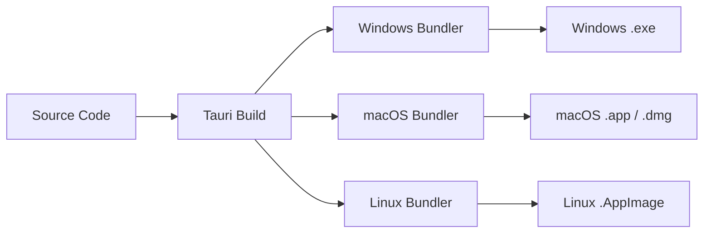

# Floe Build and Installer Guide

This guide explains how to build release installers for Floe, a Tauri 2 desktop app with a React, TypeScript, Vite frontend and a Rust backend.

Floe keeps audio in memory by default, converts recordings to 16 kHz mono 16-bit PCM WAV, and sends one complete Groq Whisper Turbo (`whisper-large-v3-turbo`) Speech-to-Text request only after recording stops. The transcript text is then sent to Groq Qwen 3.6 27B (`qwen/qwen3.6-27b`) for cleanup using the same Groq API key. Installer builds must not add Cerebras, GPT-OSS cleanup, provider switching, cleanup modes, streaming, transcript chunking, transcript merging, realtime partials, or any behavior that sends audio for cleanup.

The packaged app registers a configurable global push-to-talk hotkey through the Tauri 2 global shortcut plugin. The default is `Alt+Space` (shown as `Option + Space`) on macOS and `Control+Space` (shown as `Ctrl + Space`) on Windows/Linux.

Floe also supports optional Start at login through the Tauri 2 autostart plugin. When enabled, the installed app launches with `--background`, creates the tray icon, registers the configured hotkey, and keeps the main window hidden until the user chooses tray `Show Floe`.

Floe uses the Tauri 2 single-instance plugin to guarantee one app process at a time. The plugin is registered as the first plugin in the Tauri builder and is included as a desktop-only target dependency so mobile builds remain unaffected. Secondary launches (Start Menu, Desktop, Explorer, or a manual launch while Start at login is also active) notify the primary process to show and focus the existing main window instead of starting a second tray, hotkey, audio manager, or recording flow. The Windows release binary keeps `windows_subsystem = "windows"` in `main.rs`, so the single-instance behavior does not reintroduce a console window.

## Project Build Overview

Floe uses `corepack pnpm run tauri:build` for the default Tauri build and `corepack pnpm exec tauri build --bundles <target>` when selecting one bundle type explicitly. Tauri first runs `corepack pnpm build`, which runs `tsc && vite build` and writes frontend assets to `dist/`. Tauri then compiles the Rust app in `src-tauri/` and hands the release binary to the platform bundler.



Verified project configuration:

| Setting                  | Value                                                                                                                                                 |
| ------------------------ | ----------------------------------------------------------------------------------------------------------------------------------------------------- |
| npm package name         | `floe`                                                                                                                                                |
| Cargo package name       | `floe`                                                                                                                                                |
| Product name             | `Floe`                                                                                                                                                |
| Version                  | `1.0.0`                                                                                                                                               |
| Identifier               | `dev.floe.desktop`                                                                                                                                    |
| Tauri config             | `src-tauri/tauri.conf.json`                                                                                                                           |
| Bundle active            | `true`                                                                                                                                                |
| Bundle targets           | `all`                                                                                                                                                 |
| Icons                    | `src-tauri/icons/32x32.png`, `src-tauri/icons/128x128.png`, `src-tauri/icons/128x128@2x.png`, `src-tauri/icons/icon.icns`, `src-tauri/icons/icon.ico` |
| Autostart launch arg     | `--background`                                                                                                                                        |
| Windows installer target | `nsis` for `.exe`, optional `msi`                                                                                                                     |
| macOS targets            | `app`, `dmg`                                                                                                                                          |
| Linux targets            | `appimage`                                                                                                                                            |

## Required Build Dependencies

Install these common tools on every build host:

- Node.js 24, matching CI.
- Corepack with pnpm 10.12.1: `corepack enable` and `corepack prepare pnpm@10.12.1 --activate`.
- Rust stable with Cargo, rustfmt, and clippy.
- Tauri host prerequisites for the target platform.

Install project dependencies:

```powershell
corepack pnpm install --frozen-lockfile
```

Recommended checks before producing installers:

```powershell
corepack pnpm run format
corepack pnpm run lint
corepack pnpm run test
corepack pnpm run build
cargo fmt --manifest-path src-tauri/Cargo.toml --check
cargo clippy --manifest-path src-tauri/Cargo.toml --all-targets -- -D warnings
cargo test --manifest-path src-tauri/Cargo.toml
corepack pnpm exec tauri info
```

## Windows Installer Instructions

Build Windows installers on Windows with Microsoft C++ Build Tools, the `Desktop development with C++` workload, the Windows SDK, Rust stable for `x86_64-pc-windows-msvc`, and Microsoft Edge WebView2 Runtime. Windows 10 and Windows 11 normally include WebView2.

Build the `.exe` installer with NSIS:

```powershell
corepack pnpm exec tauri build --bundles nsis
```

The NSIS setup executable is written to:

```text
src-tauri/target/release/bundle/nsis/
```

To build an MSI on Windows, use:

```powershell
corepack pnpm exec tauri build --bundles msi
```

MSI output is expected at:

```text
src-tauri/target/release/bundle/msi/
```

MSI builds require WiX support and may require the Windows VBSCRIPT optional feature if `light.exe` fails.

## macOS Build Instructions

Build macOS artifacts on a macOS host with Xcode or Xcode Command Line Tools installed. A Windows host cannot produce signed or notarized macOS release artifacts.

Build the `.app` bundle:

```bash
corepack pnpm exec tauri build --bundles app
```

Build the `.dmg` installer:

```bash
corepack pnpm exec tauri build --bundles dmg
```

Expected output locations:

```text
src-tauri/target/release/bundle/macos/
src-tauri/target/release/bundle/dmg/
```

Release distribution outside the Mac App Store should use Apple code signing and notarization. Unsigned local builds are useful for smoke testing but are not release-ready.

## Linux AppImage Build Instructions

Build the AppImage on any Linux host with Tauri's Linux dependencies installed. The AppImage bundles all runtime dependencies, so it runs on any modern Linux distribution without additional package installation.

Install system dependencies:

```bash
sudo apt update
sudo apt install -y \
  libwebkit2gtk-4.1-dev \
  build-essential \
  curl \
  wget \
  file \
  libxdo-dev \
  libssl-dev \
  libayatana-appindicator3-dev \
  librsvg2-dev \
  libasound2-dev \
  libdbus-1-dev
```

Build the AppImage:

```bash
corepack pnpm exec tauri build --bundles appimage
```

Expected output location:

```text
src-tauri/target/release/bundle/appimage/
```

Build on the oldest supported base OS practical for the release. Building on a newer Linux distribution can raise the minimum glibc version required by Floe.

### Running the AppImage

The AppImage needs `fuse2` or `fuse3` to run:

```bash
chmod +x Floe-*.AppImage
./Floe-*.AppImage
```

For desktop integration, use a tool like `appimaged` or extract the AppImage with `--appimage-extract`.

## Artifact Output Locations

Tauri writes artifacts under `src-tauri/target/release/bundle/` for native builds on the current host:

| Platform            | Command                                             | Output directory                            |
| ------------------- | --------------------------------------------------- | ------------------------------------------- |
| Windows NSIS `.exe` | `corepack pnpm exec tauri build --bundles nsis`     | `src-tauri/target/release/bundle/nsis/`     |
| Windows MSI `.msi`  | `corepack pnpm exec tauri build --bundles msi`      | `src-tauri/target/release/bundle/msi/`      |
| macOS `.app`        | `corepack pnpm exec tauri build --bundles app`      | `src-tauri/target/release/bundle/macos/`    |
| macOS `.dmg`        | `corepack pnpm exec tauri build --bundles dmg`      | `src-tauri/target/release/bundle/dmg/`      |
| Linux `.AppImage`   | `corepack pnpm exec tauri build --bundles appimage` | `src-tauri/target/release/bundle/appimage/` |

When cross-compiling with an explicit Rust target, Tauri may place bundle output below `src-tauri/target/<target-triple>/release/bundle/`.

Installer artifacts are ignored by Git because `src-tauri/target/` is ignored.

## Release Builds via CI

The release pipeline lives in `.github/workflows/release.yml` and builds platform-specific artifacts attached to each GitHub release. The matrix currently covers Windows (`.exe`/`.msi`), macOS (`.dmg`), and Linux (`.AppImage`).

**Triggers**

- `push` of a tag matching `v*` (for example `v1.0.0`).
- `workflow_dispatch` for a manual pre-flight run with a short reason string. The manual run is intended for sanity checks before cutting a release tag; it still creates a draft release with the head `ref_name`, so prefer to push a dedicated test tag like `v0.0.0-preflight` and delete it after the run.

**What the job does**

1. Checks out the repository with full history.
2. Sets up pnpm 10.12.1, Node 24, Rust stable (rustfmt, clippy) and the Cargo cache.
3. Runs `pnpm install --frozen-lockfile`.
4. Runs the same pre-build quality checks as `ci.yml` (format, lint, tsc, vitest, `cargo fmt --check`, `cargo clippy -D warnings`, `cargo test`). A failing check fails the release job; this is intentional so broken releases never reach a draft.
5. Emits a warning if any of the optional signing secrets are missing. The job continues and produces an unsigned installer.
6. Calls `tauri-apps/tauri-action@v0` with `--bundles nsis`, which builds the Windows NSIS installer, signs it when the signing secrets are present, and attaches it to a **draft** GitHub release.

**Draft release workflow**

1. After the workflow finishes, open the draft release in the GitHub web UI.
2. Edit the release notes (CHANGELOG highlights, breaking changes, known issues).
3. Click _Publish release_ once the artifact has been smoke-tested on a real Windows machine.
4. If the build is broken, _Close_ the draft and fix the failure before re-tagging.

## Code Signing (Windows)

Code signing is optional in the first cut. Without signing secrets the pipeline still produces a working installer; with them, the NSIS executable is signed so Windows SmartScreen and corporate AppLocker policies treat the install as trusted.

**Required repository secrets**

| Secret                               | Description                                                                                                                                                                                                                    |
| ------------------------------------ | ------------------------------------------------------------------------------------------------------------------------------------------------------------------------------------------------------------------------------ |
| `WINDOWS_CERTIFICATE`                | Base64-encoded `.pfx` (or `.p12`) file issued by a trusted CA such as DigiCert, Sectigo, or your enterprise CA. Encode it with `base64 -w0 floe.pfx \| Set-Clipboard` or `certutil -encode floe.pfx floe.pfx.b64` on the host. |
| `WINDOWS_CERTIFICATE_PASSWORD`       | Password for the `.pfx`. Store in GitHub Actions secrets only; never commit.                                                                                                                                                   |
| `TAURI_SIGNING_PRIVATE_KEY`          | Base64-encoded Tauri update signing key generated via `pnpm exec tauri signer generate -w ~/.tauri/floe.key`. The Tauri updater uses this to sign the update manifest.                                                         |
| `TAURI_SIGNING_PRIVATE_KEY_PASSWORD` | Password for the Tauri signing key.                                                                                                                                                                                            |

`tauri-action` reads these automatically, so no workflow changes are required once the secrets are set. The `Warn if signing secrets are missing` step surfaces a job-summary warning for any secret that is empty, which is the only visible signal during a build with no secrets.

**Local smoke test of an unsigned build**

```powershell
corepack pnpm install --frozen-lockfile
corepack pnpm run build
corepack pnpm exec tauri build --bundles nsis
```

The unsigned installer lands in `src-tauri/target/release/bundle/nsis/` and can be installed with a one-off _More info → Run anyway_ on SmartScreen.

## Bundle Identifier and Keyring

Floe's bundle identifier is `dev.floe.desktop`, which is also the service name used by the platform keyring to store the Groq API key (`groq-api-key` user). Earlier builds used `com.floe.app`; the suffix `.app` triggered a Tauri macOS bundle-identifier warning, so the identifier was migrated to the cleaner `dev.floe.desktop`.

**Migrating from older builds**

`settings::migrate_legacy_keyring_entries()` runs at the very start of the Tauri `setup` closure on every launch, before the `SettingsManager` is constructed. It reads from the `com.floe.app` service and, if a key is found there, copies it to `dev.floe.desktop` and clears the legacy entry. The migration is idempotent and best-effort: any keyring error is swallowed so a broken legacy store never blocks startup.

A test in `settings.rs` (`keyring_service_matches_documented_bundle_identifier`) keeps `KEYRING_SERVICE` in lockstep with the documented identifier, and `legacy_keyring_services_are_recorded_for_migration` documents the legacy list so future identifier changes can extend it.

## Troubleshooting

- If `pnpm` is unavailable, run commands through Corepack: `corepack pnpm ...`.
- If Tauri cannot find WebView2 on Windows, install the Microsoft Edge WebView2 Runtime.
- If Windows compilation fails before bundling, confirm Visual Studio Build Tools includes `Desktop development with C++` and the Windows SDK.
- If NSIS `.exe` bundling fails, rerun `corepack pnpm exec tauri build --bundles nsis -v` and check for missing NSIS or signing tools.
- If MSI bundling fails with `light.exe`, enable the Windows VBSCRIPT optional feature and verify WiX is available.
- If Linux builds fail with missing WebKitGTK, install the platform packages above and rerun `corepack pnpm exec tauri info`.
- If Linux builds fail with audio or D-Bus headers, install `libasound2-dev` and `libdbus-1-dev` on Debian/Ubuntu or `alsa-lib-devel` and `dbus-devel` on Fedora/RHEL.
- If macOS builds fail during signing or notarization, verify the Apple Developer certificate, provisioning settings, keychain access, and notarization credentials.
- If global hotkeys do not work in a packaged macOS build, check Privacy & Security permissions for Accessibility and Input Monitoring.
- If a hotkey does not register on Windows/Linux, the OS or desktop environment may already reserve it; reset to default or choose another combination from Settings.
- If Start at login does not launch Floe, confirm the installed app is still present, OS login item permissions allow it, and the desktop environment supports autostart. On Linux, tray visibility depends on AppIndicator/system tray support.
- If Floe appears to vanish after clicking the window close button, the process is still running in the system tray so the global hotkey remains active. Use the tray `Quit` menu item to fully exit. On Linux desktops without an AppIndicator extension, the tray icon may not be visible; the process can still be ended through the OS task manager.
- Do not log raw transcripts, raw audio, full API keys, auth headers, private keys, or signing secrets while debugging builds.

## Future Release Automation

The release matrix in `.github/workflows/release.yml` currently covers all three platforms. To add or change targets, edit the `bundles` values in the matrix include section and update the `tauri.conf.json` `"targets"` list accordingly.

Each additional job should follow the same pattern: install pnpm/Node/Rust, run the pre-build quality checks, warn on missing signing secrets, and invoke `tauri-apps/tauri-action@v0` with the platform-specific `--bundles` value. Keep signing keys, Apple credentials, GPG keys, and Windows certificates in GitHub Actions secrets only, and publish artifacts to a draft GitHub Release for manual verification before making the release public.

## Arch Linux (AUR)

Floe is available on the AUR as `floe-bin`. It downloads the pre-built AppImage from GitHub Releases and installs it with proper desktop integration:

```bash
# Using yay
yay -S floe-bin

# Using paru
paru -S floe-bin
```

The AUR repository is maintained at `jeremymiribung-blip/aur-floe-bin` and is automatically updated by CI whenever a new release tag is pushed. Submit any packaging issues there.

References:

- Tauri Windows installer: https://v2.tauri.app/distribute/windows-installer/
- Tauri macOS app bundle: https://v2.tauri.app/distribute/macos-application-bundle/
- Tauri macOS DMG: https://v2.tauri.app/distribute/dmg/
- Tauri AppImage: https://v2.tauri.app/distribute/appimage/
- Tauri prerequisites: https://v2.tauri.app/start/prerequisites/
- Tauri app icons: https://v2.tauri.app/develop/icons/
- Arch User Repository: https://wiki.archlinux.org/title/Arch_User_Repository
