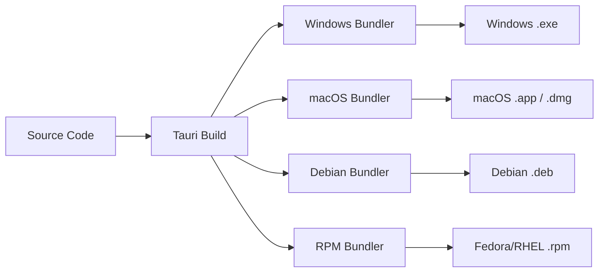

# Floe Build and Installer Guide

This guide explains how to build release installers for Floe, a Tauri 2 desktop app with a React, TypeScript, Vite frontend and a Rust backend.

Floe keeps audio in memory by default and sends one complete Groq Speech-to-Text request only after recording stops. The transcript text is then sent to Groq for cleanup. Installer builds must not add streaming, transcript chunking, transcript merging, realtime partials, or any behavior that sends audio for cleanup.

The packaged app registers a configurable global push-to-talk hotkey through the Tauri 2 global shortcut plugin. The default is `CommandOrControl+Shift+Space` on macOS and `Control+Shift+Space` on Windows/Linux.

Floe also supports optional Start at login through the Tauri 2 autostart plugin. When enabled, the installed app launches with `--background`, creates the tray icon, registers the configured hotkey, and keeps the main window hidden until the user chooses tray `Show Floe`.

## Project Build Overview

Floe uses `corepack pnpm run tauri:build` for the default Tauri build and `corepack pnpm exec tauri build --bundles <target>` when selecting one bundle type explicitly. Tauri first runs `corepack pnpm build`, which runs `tsc && vite build` and writes frontend assets to `dist/`. Tauri then compiles the Rust app in `src-tauri/` and hands the release binary to the platform bundler.



Verified project configuration:

| Setting                  | Value                                                                                                                                                 |
| ------------------------ | ----------------------------------------------------------------------------------------------------------------------------------------------------- |
| npm package name         | `floe`                                                                                                                                                |
| Cargo package name       | `floe`                                                                                                                                                |
| Product name             | `Floe`                                                                                                                                                |
| Version                  | `0.1.0`                                                                                                                                               |
| Identifier               | `com.floe.app`                                                                                                                                        |
| Tauri config             | `src-tauri/tauri.conf.json`                                                                                                                           |
| Bundle active            | `true`                                                                                                                                                |
| Bundle targets           | `all`                                                                                                                                                 |
| Icons                    | `src-tauri/icons/32x32.png`, `src-tauri/icons/128x128.png`, `src-tauri/icons/128x128@2x.png`, `src-tauri/icons/icon.icns`, `src-tauri/icons/icon.ico` |
| Autostart launch arg     | `--background`                                                                                                                                        |
| Windows installer target | `nsis` for `.exe`, optional `msi`                                                                                                                     |
| macOS targets            | `app`, `dmg`                                                                                                                                          |
| Linux targets            | `deb`, `rpm`                                                                                                                                          |

## Required Build Dependencies

Install these common tools on every build host:

- Node.js 24, matching CI.
- Corepack with pnpm 10.12.1: `corepack enable` and `corepack prepare pnpm@10.12.1 --activate`.
- Rust stable with Cargo, rustfmt, and clippy.
- Tauri host prerequisites for the target platform.

Install project dependencies:

```powershell
corepack pnpm install --frozen-lockfile
```

Recommended checks before producing installers:

```powershell
corepack pnpm run format
corepack pnpm run lint
corepack pnpm run test
corepack pnpm run build
cargo fmt --manifest-path src-tauri/Cargo.toml --check
cargo clippy --manifest-path src-tauri/Cargo.toml --all-targets -- -D warnings
cargo test --manifest-path src-tauri/Cargo.toml
corepack pnpm exec tauri info
```

## Windows Installer Instructions

Build Windows installers on Windows with Microsoft C++ Build Tools, the `Desktop development with C++` workload, the Windows SDK, Rust stable for `x86_64-pc-windows-msvc`, and Microsoft Edge WebView2 Runtime. Windows 10 and Windows 11 normally include WebView2.

Build the `.exe` installer with NSIS:

```powershell
corepack pnpm exec tauri build --bundles nsis
```

The NSIS setup executable is written to:

```text
src-tauri/target/release/bundle/nsis/
```

To build an MSI on Windows, use:

```powershell
corepack pnpm exec tauri build --bundles msi
```

MSI output is expected at:

```text
src-tauri/target/release/bundle/msi/
```

MSI builds require WiX support and may require the Windows VBSCRIPT optional feature if `light.exe` fails.

## macOS Build Instructions

Build macOS artifacts on a macOS host with Xcode or Xcode Command Line Tools installed. A Windows host cannot produce signed or notarized macOS release artifacts.

Build the `.app` bundle:

```bash
corepack pnpm exec tauri build --bundles app
```

Build the `.dmg` installer:

```bash
corepack pnpm exec tauri build --bundles dmg
```

Expected output locations:

```text
src-tauri/target/release/bundle/macos/
src-tauri/target/release/bundle/dmg/
```

Release distribution outside the Mac App Store should use Apple code signing and notarization. Unsigned local builds are useful for smoke testing but are not release-ready.

## Debian .deb Build Instructions

Build Debian packages on a Debian or Ubuntu host. Tauri packages the desktop file, app icons, and Linux runtime dependencies for the generated package.

Install system dependencies:

```bash
sudo apt update
sudo apt install -y \
  libwebkit2gtk-4.1-dev \
  build-essential \
  curl \
  wget \
  file \
  libxdo-dev \
  libssl-dev \
  libayatana-appindicator3-dev \
  librsvg2-dev \
  libasound2-dev \
  libdbus-1-dev
```

Build the `.deb`:

```bash
corepack pnpm exec tauri build --bundles deb
```

Expected output location:

```text
src-tauri/target/release/bundle/deb/
```

Build on the oldest supported base OS practical for the release. Building on a newer Linux distribution can raise the minimum glibc version required by Floe.

## Fedora/RHEL .rpm Build Instructions

Build RPM packages on Fedora, RHEL, or a compatible host. Install Tauri's Linux dependencies plus audio and D-Bus development headers used by Floe's Rust dependencies.

Install system dependencies:

```bash
sudo dnf check-update
sudo dnf install -y \
  webkit2gtk4.1-devel \
  openssl-devel \
  curl \
  wget \
  file \
  libappindicator-gtk3-devel \
  librsvg2-devel \
  libxdo-devel \
  alsa-lib-devel \
  dbus-devel
sudo dnf group install -y "c-development"
```

Build the `.rpm`:

```bash
corepack pnpm exec tauri build --bundles rpm
```

Expected output location:

```text
src-tauri/target/release/bundle/rpm/
```

RPM signing is optional for local builds and recommended for published releases. Keep GPG private keys out of the repository and CI logs.

## Artifact Output Locations

Tauri writes artifacts under `src-tauri/target/release/bundle/` for native builds on the current host:

| Platform            | Command                                         | Output directory                         |
| ------------------- | ----------------------------------------------- | ---------------------------------------- |
| Windows NSIS `.exe` | `corepack pnpm exec tauri build --bundles nsis` | `src-tauri/target/release/bundle/nsis/`  |
| Windows MSI `.msi`  | `corepack pnpm exec tauri build --bundles msi`  | `src-tauri/target/release/bundle/msi/`   |
| macOS `.app`        | `corepack pnpm exec tauri build --bundles app`  | `src-tauri/target/release/bundle/macos/` |
| macOS `.dmg`        | `corepack pnpm exec tauri build --bundles dmg`  | `src-tauri/target/release/bundle/dmg/`   |
| Debian `.deb`       | `corepack pnpm exec tauri build --bundles deb`  | `src-tauri/target/release/bundle/deb/`   |
| Fedora/RHEL `.rpm`  | `corepack pnpm exec tauri build --bundles rpm`  | `src-tauri/target/release/bundle/rpm/`   |

When cross-compiling with an explicit Rust target, Tauri may place bundle output below `src-tauri/target/<target-triple>/release/bundle/`.

Installer artifacts are ignored by Git because `src-tauri/target/` is ignored.

## Troubleshooting

- If `pnpm` is unavailable, run commands through Corepack: `corepack pnpm ...`.
- If Tauri cannot find WebView2 on Windows, install the Microsoft Edge WebView2 Runtime.
- If Windows compilation fails before bundling, confirm Visual Studio Build Tools includes `Desktop development with C++` and the Windows SDK.
- If NSIS `.exe` bundling fails, rerun `corepack pnpm exec tauri build --bundles nsis -v` and check for missing NSIS or signing tools.
- If MSI bundling fails with `light.exe`, enable the Windows VBSCRIPT optional feature and verify WiX is available.
- Current builds warn that `com.floe.app` ends with `.app`, which Tauri does not recommend for macOS bundle identifiers. This is not an installer blocker; change it only as a deliberate app-identity migration.
- If Linux builds fail with missing WebKitGTK, install the platform packages above and rerun `corepack pnpm exec tauri info`.
- If Linux builds fail with audio or D-Bus headers, install `libasound2-dev` and `libdbus-1-dev` on Debian/Ubuntu or `alsa-lib-devel` and `dbus-devel` on Fedora/RHEL.
- If macOS builds fail during signing or notarization, verify the Apple Developer certificate, provisioning settings, keychain access, and notarization credentials.
- If global hotkeys do not work in a packaged macOS build, check Privacy & Security permissions for Accessibility and Input Monitoring.
- If a hotkey does not register on Windows/Linux, the OS or desktop environment may already reserve it; reset to default or choose another combination from Settings.
- If Start at login does not launch Floe, confirm the installed app is still present, OS login item permissions allow it, and the desktop environment supports autostart. On Linux, tray visibility depends on AppIndicator/system tray support.
- If Floe appears to vanish after clicking the window close button, the process is still running in the system tray so the global hotkey remains active. Use the tray `Quit` menu item to fully exit. On Linux desktops without an AppIndicator extension, the tray icon may not be visible; the process can still be ended through the OS task manager.
- Do not log raw transcripts, raw audio, full API keys, auth headers, private keys, or signing secrets while debugging builds.

## Future GitHub Actions Release Automation

Release automation should use a matrix with native runners:

- `windows-latest` for NSIS `.exe` and optional MSI.
- `macos-latest` for `.app` and `.dmg`, with signing and notarization secrets configured as GitHub Actions secrets.
- `ubuntu-latest` or an older supported Ubuntu image/container for `.deb`.
- Fedora or RHEL-compatible container/runner for `.rpm`.

Recommended workflow shape:

1. Trigger on version tags such as `v0.1.0`.
2. Install pnpm, Node 24, Rust stable, and platform system dependencies.
3. Run the same checks listed in this guide before bundling.
4. Build one artifact type per matrix entry with an explicit `--bundles` value.
5. Upload artifacts with names that include product, version, platform, architecture, and bundle type.
6. Keep signing keys, Apple credentials, GPG keys, and Windows certificates in GitHub Actions secrets only.
7. Publish artifacts to a draft GitHub Release for manual verification before making the release public.

References:

- Tauri Windows installer: https://v2.tauri.app/distribute/windows-installer/
- Tauri macOS app bundle: https://v2.tauri.app/distribute/macos-application-bundle/
- Tauri macOS DMG: https://v2.tauri.app/distribute/dmg/
- Tauri Debian package: https://v2.tauri.app/distribute/debian/
- Tauri RPM package: https://v2.tauri.app/distribute/rpm/
- Tauri prerequisites: https://v2.tauri.app/start/prerequisites/
- Tauri app icons: https://v2.tauri.app/develop/icons/
